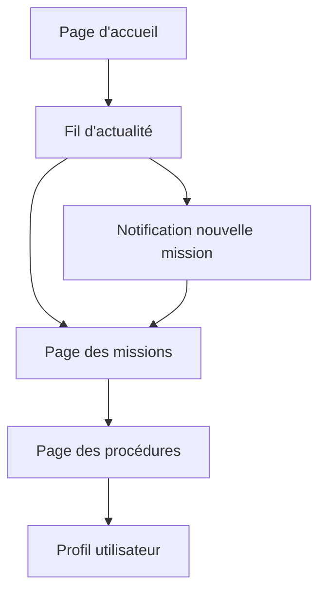

## 1. Vue d'ensemble du produit

Procedio est une plateforme SaaS industrielle de gestion des connaissances et de contrôle des missions, alimentée par l'IA. Elle centralise les procédures, gamifie l'apprentissage et rationalise les missions opérationnelles grâce à une interface moderne et élégante.

La plateforme permet aux équipes techniques de haute performance de gérer efficacement leurs procédures, suivre les missions en temps réel et progresser dans leur apprentissage grâce à des fonctionnalités de gamification.

## 2. Fonctionnalités principales

### 2.1 Rôles utilisateur

| Rôle | Méthode d'inscription | Permissions principales |
|------|----------------------|------------------------|
| Manager | Invitation par email | Créer/modifier des procédures, assigner des missions, voir les KPIs |
| Technicien | Invitation par email | Consulter les procédures, recevoir des missions, mettre à jour le statut |

### 2.2 Module de fonctionnalités

Les exigences de notre plateforme Procedio se composent des pages principales suivantes :

1. **Page d'accueil** : Section héro, navigation, tableau de bord des missions
2. **Fil d'actualité** : Notifications en temps réel, nouvelles missions disponibles, mises à jour des procédures
3. **Page des procédures** : Liste des procédures, détails, recherche IA
4. **Page des missions** : Création, assignation, suivi des missions
5. **Profil utilisateur** : Informations personnelles, progression, badges

### 2.3 Détails des pages

| Page | Module | Description de la fonctionnalité |
|------|--------|-------------------------------|
| Page d'accueil | Tableau de bord | Affiche les missions en cours, statistiques personnelles, raccourcis vers les fonctionnalités principales |
| Fil d'actualité | Notifications | Affiche les nouvelles missions disponibles en temps réel, mises à jour des procédures, annonces importantes |
| Fil d'actualité | Système de notification | Notifie instantanément les techniciens quand une nouvelle mission est créée par un manager |
| Procédures | Recherche IA | Permet de rechercher des procédures avec assistance IA pour un support technique instantané |
| Procédures | Liste des procédures | Affiche toutes les procédures disponibles avec filtres par catégorie et niveau de difficulté |
| Missions | Création de mission | Permet aux managers de créer et assigner des missions avec documents joints et échéances |
| Missions | Suivi des missions | Permet aux techniciens de voir et mettre à jour le statut de leurs missions |
| Profil | Progression | Affiche l'XP accumulé, les badges obtenus et le niveau de maîtrise |

## 3. Processus principal

### Flux utilisateur principal

1. **Manager** : Crée une nouvelle mission → Système de notification → Fil d'actualité mis à jour → Techniciens notifiés
2. **Technicien** : Consulte le fil d'actualité → Voir nouvelle mission → Accepte la mission → Met à jour le statut → Manager notifié

## 4. Interface utilisateur

### 4.1 Style de design

- **Couleurs principales** : Bleu industriel (#1e40af), Gris clair (#f3f4f6)
- **Couleurs secondaires** : Vert succès (#10b981), Rouge alerte (#ef4444)
- **Style des boutons** : Coins arrondis, ombres subtiles
- **Police** : Inter, tailles 14-16px pour le corps, 18-20px pour les titres
- **Mise en page** : Base sur des cartes, navigation latérale
- **Icônes** : Style outline moderne

### 4.2 Aperçu du design des pages

| Page | Module | Éléments d'interface |
|------|--------|---------------------|
| Fil d'actualité | Notifications | Cartes de notification avec badge "Nouveau", horodatage, icônes de type de notification |
| Fil d'actualité | Nouvelle mission | Carte mission avec titre, description, priorité, bouton "Voir détails" en évidence |
| Page d'accueil | Tableau de bord | Grille de cartes KPI, graphiques de progression, liste des missions récentes |
| Missions | Liste des missions | Tableau avec filtres, statuts colorés, boutons d'action contextuels |

### 4.3 Responsive

Design desktop-first avec adaptation mobile. Optimisation tactile pour les interactions sur tablette.

## 5. Notifications de nouvelles missions

Le système de notification de nouvelles missions se fait exclusivement via le fil d'actualité :

- **Notification instantanée** : Dès qu'un manager crée une mission, elle apparaît en haut du fil d'actualité
- **Badge visuel** : Indicateur "Nouveau" rouge sur la carte de la mission
- **Tri chronologique** : Les nouvelles missions apparaissent en premier dans le fil
- **Non-intrusif** : Pas de pop-up ou d'interruption, simplement une mise à jour du fil
- **Historique** : Les missions restent dans le fil avec leur statut mis à jour en temps réel