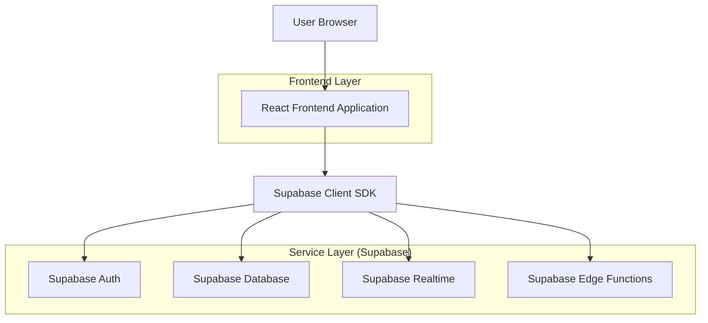
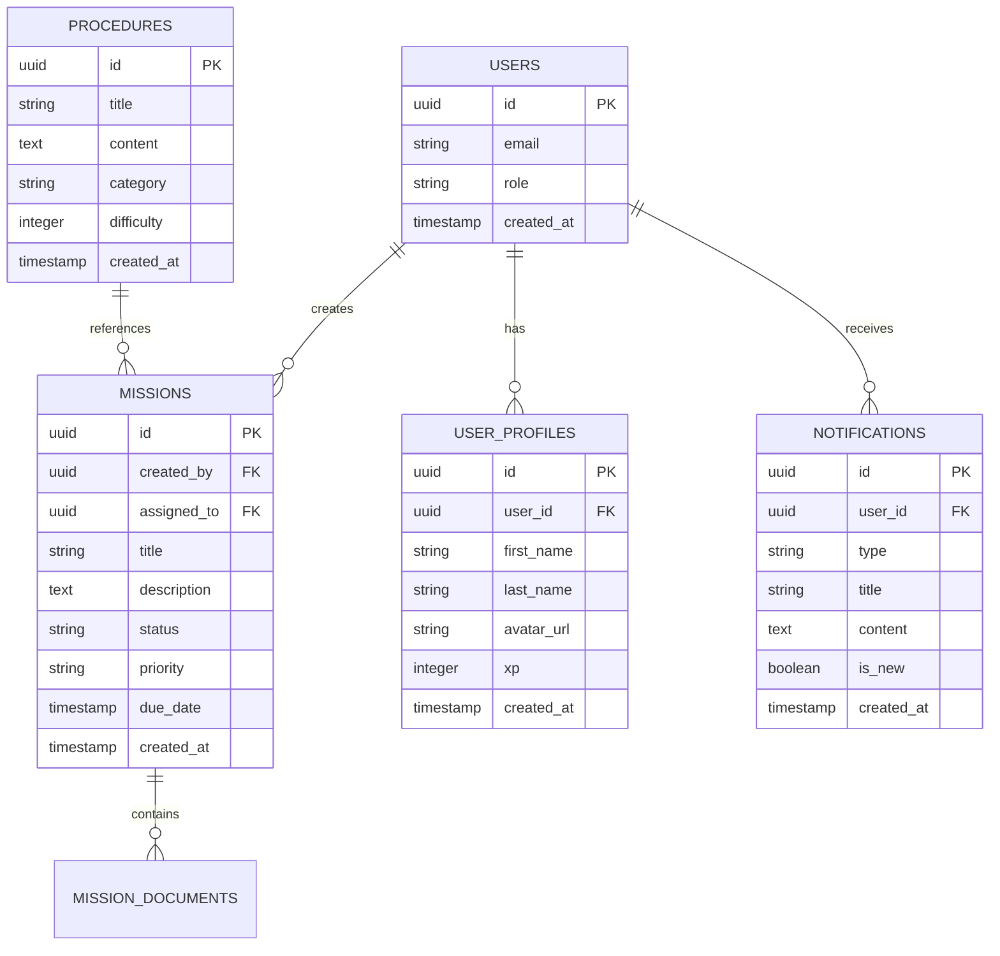

## 1. Architecture design



## 2. Description des technologies

- **Frontend** : React@18 + TypeScript + Vite
- **Styling** : Vanilla CSS avec design system premium
- **Backend** : Supabase (PostgreSQL, Auth, Realtime, Edge Functions)
- **Base de données** : PostgreSQL via Supabase
- **Authentification** : Supabase Auth avec JWT
- **Temps réel** : Supabase Realtime pour les notifications
- **IA** : Edge Functions pour l'intégration OpenAI/DeepSeek

## 3. Définitions des routes

| Route | Objectif |
|-------|----------|
| / | Page d'accueil et tableau de bord |
| /feed | Fil d'actualité avec notifications |
| /procedures | Liste et recherche des procédures |
| /missions | Gestion des missions |
| /profile | Profil utilisateur et progression |
| /login | Page de connexion |
| /register | Page d'inscription |

## 4. Définitions des API

### 4.1 API de notification de nouvelles missions

```
POST /api/missions/create
```

Requête:
| Paramètre | Type | Requis | Description |
|-----------|------|--------|-------------|
| title | string | true | Titre de la mission |
| description | string | true | Description détaillée |
| priority | string | true | Niveau de priorité |
| assigned_to | uuid | false | ID de l'utilisateur assigné |
| due_date | timestamp | false | Date d'échéance |

Réponse:
| Paramètre | Type | Description |
|-----------|------|-------------|
| mission_id | uuid | ID de la mission créée |
| status | string | Statut de la création |
| notification_sent | boolean | Confirmation d'envoi au fil d'actualité |

### 4.2 API de récupération du fil d'actualité

```
GET /api/feed
```

Réponse:
```json
{
  "notifications": [
    {
      "id": "uuid",
      "type": "NEW_MISSION",
      "title": "Nouvelle mission disponible",
      "content": "Mission de maintenance créée",
      "is_new": true,
      "created_at": "2024-01-01T00:00:00Z"
    }
  ]
}
```

## 5. Schéma de la base de données



## 6. Langage de définition des données

### Table des notifications (notifications)
```sql
-- créer la table
CREATE TABLE notifications (
  id UUID PRIMARY KEY DEFAULT gen_random_uuid(),
  user_id UUID REFERENCES auth.users(id) ON DELETE CASCADE,
  type VARCHAR(50) NOT NULL CHECK (type IN ('NEW_MISSION', 'MISSION_UPDATE', 'PROCEDURE_UPDATE')),
  title VARCHAR(255) NOT NULL,
  content TEXT,
  is_new BOOLEAN DEFAULT true,
  created_at TIMESTAMP WITH TIME ZONE DEFAULT NOW(),
  read_at TIMESTAMP WITH TIME ZONE
);

-- créer les index
CREATE INDEX idx_notifications_user_id ON notifications(user_id);
CREATE INDEX idx_notifications_is_new ON notifications(is_new);
CREATE INDEX idx_notifications_created_at ON notifications(created_at DESC);

-- politiques RLS
ALTER TABLE notifications ENABLE ROW LEVEL SECURITY;

-- Les utilisateurs peuvent voir leurs propres notifications
CREATE POLICY "Users can view own notifications" 
  ON notifications FOR SELECT 
  USING (auth.uid() = user_id);

-- Les notifications sont créées via des triggers
CREATE POLICY "System can create notifications" 
  ON notifications FOR INSERT 
  WITH CHECK (true);
```

### Table des missions (missions)
```sql
-- créer la table
CREATE TABLE missions (
  id UUID PRIMARY KEY DEFAULT gen_random_uuid(),
  created_by UUID REFERENCES auth.users(id) ON DELETE CASCADE,
  assigned_to UUID REFERENCES auth.users(id) ON DELETE SET NULL,
  title VARCHAR(255) NOT NULL,
  description TEXT,
  status VARCHAR(50) DEFAULT 'pending' CHECK (status IN ('pending', 'in_progress', 'completed', 'cancelled')),
  priority VARCHAR(20) DEFAULT 'medium' CHECK (priority IN ('low', 'medium', 'high', 'urgent')),
  due_date TIMESTAMP WITH TIME ZONE,
  completed_at TIMESTAMP WITH TIME ZONE,
  created_at TIMESTAMP WITH TIME ZONE DEFAULT NOW(),
  updated_at TIMESTAMP WITH TIME ZONE DEFAULT NOW()
);

-- créer les index
CREATE INDEX idx_missions_created_by ON missions(created_by);
CREATE INDEX idx_missions_assigned_to ON missions(assigned_to);
CREATE INDEX idx_missions_status ON missions(status);
CREATE INDEX idx_missions_priority ON missions(priority);

-- politiques RLS
ALTER TABLE missions ENABLE ROW LEVEL SECURITY;

-- Les managers peuvent créer des missions
CREATE POLICY "Managers can create missions" 
  ON missions FOR INSERT 
  WITH CHECK (EXISTS (
    SELECT 1 FROM user_profiles 
    WHERE id = auth.uid() AND role = 'MANAGER'
  ));

-- Les utilisateurs peuvent voir les missions qui leur sont assignées ou qu'ils ont créées
CREATE POLICY "Users can view relevant missions" 
  ON missions FOR SELECT 
  USING (
    created_by = auth.uid() OR 
    assigned_to = auth.uid() OR
    EXISTS (
      SELECT 1 FROM user_profiles 
      WHERE id = auth.uid() AND role = 'MANAGER'
    )
  );
```

## 7. Fonctionnalité de notification en temps réel

### Trigger pour les nouvelles missions
```sql
-- Fonction pour créer une notification quand une mission est créée
CREATE OR REPLACE FUNCTION create_mission_notification()
RETURNS TRIGGER AS $$
BEGIN
  -- Créer une notification pour le fil d'actualité
  INSERT INTO notifications (user_id, type, title, content, is_new)
  SELECT 
    u.id,
    'NEW_MISSION',
    'Nouvelle mission disponible',
    NEW.title,
    true
  FROM auth.users u
  JOIN user_profiles up ON u.id = up.id
  WHERE up.role = 'TECHNICIAN';
  
  RETURN NEW;
END;
$$ LANGUAGE plpgsql;

-- Trigger sur la table missions
CREATE TRIGGER trigger_new_mission_notification
  AFTER INSERT ON missions
  FOR EACH ROW
  EXECUTE FUNCTION create_mission_notification();
```

### Subscription Realtime
```typescript
// Frontend subscription pour les nouvelles notifications
const subscription = supabase
  .channel('notifications')
  .on('postgres_changes', 
    { event: 'INSERT', schema: 'public', table: 'notifications' },
    (payload) => {
      // Ajouter la nouvelle notification au fil d'actualité
      addNotificationToFeed(payload.new);
    }
  )
  .subscribe();
```